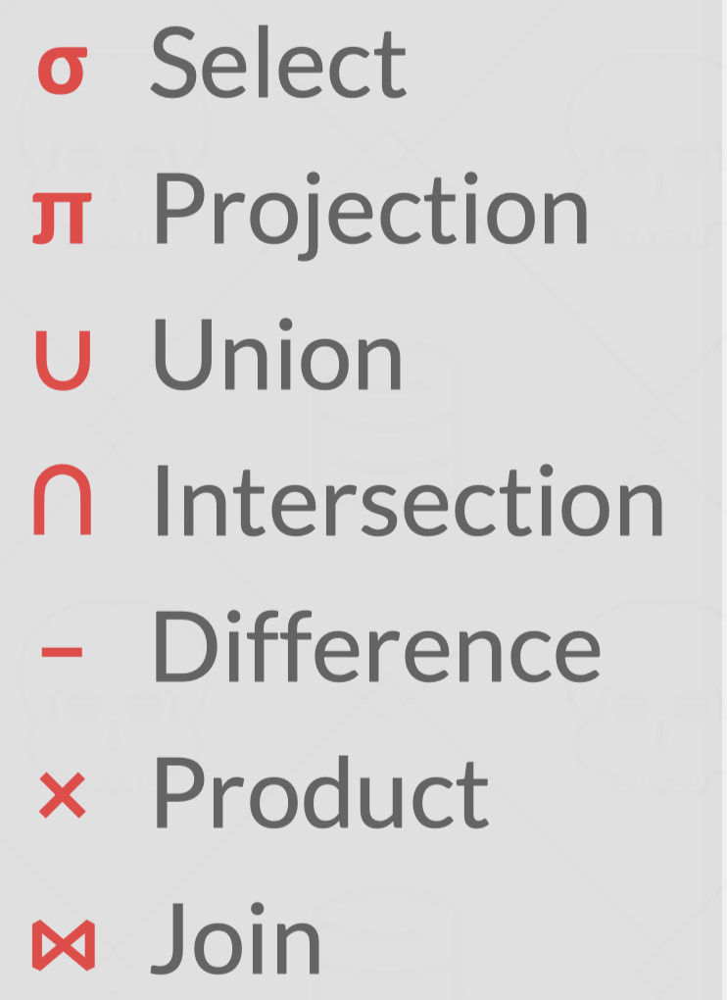
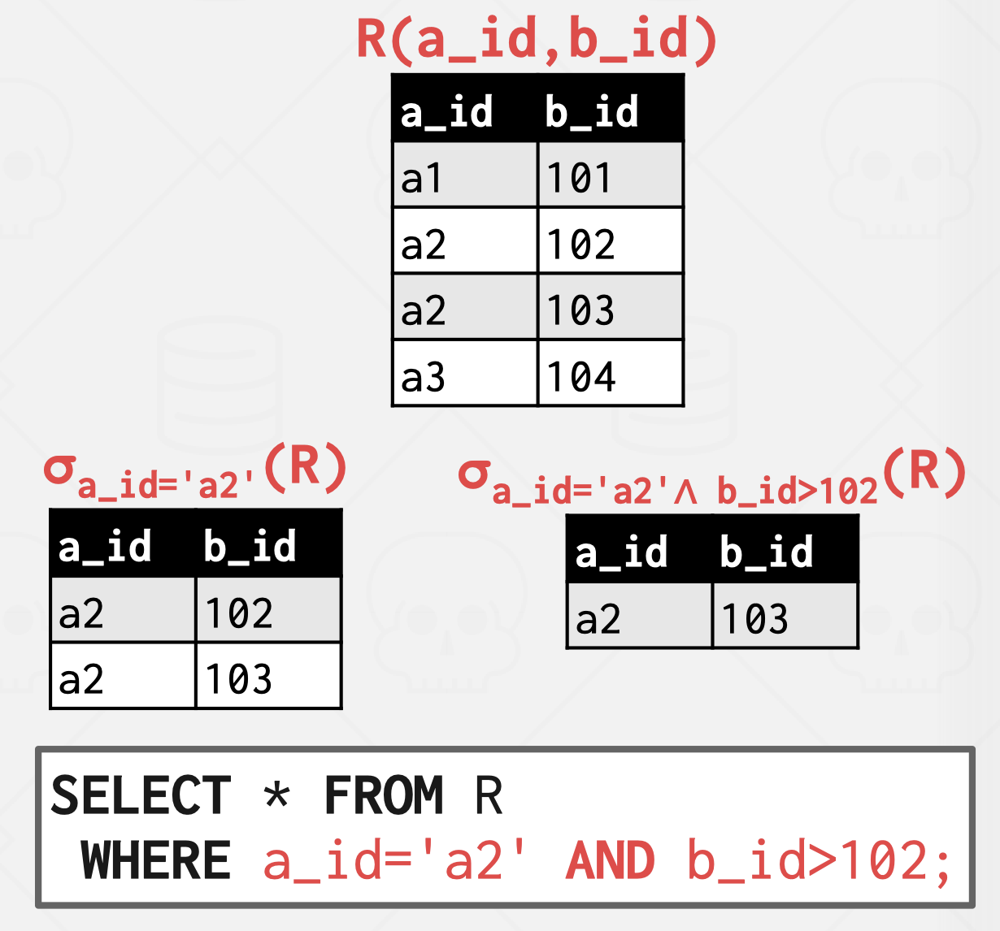
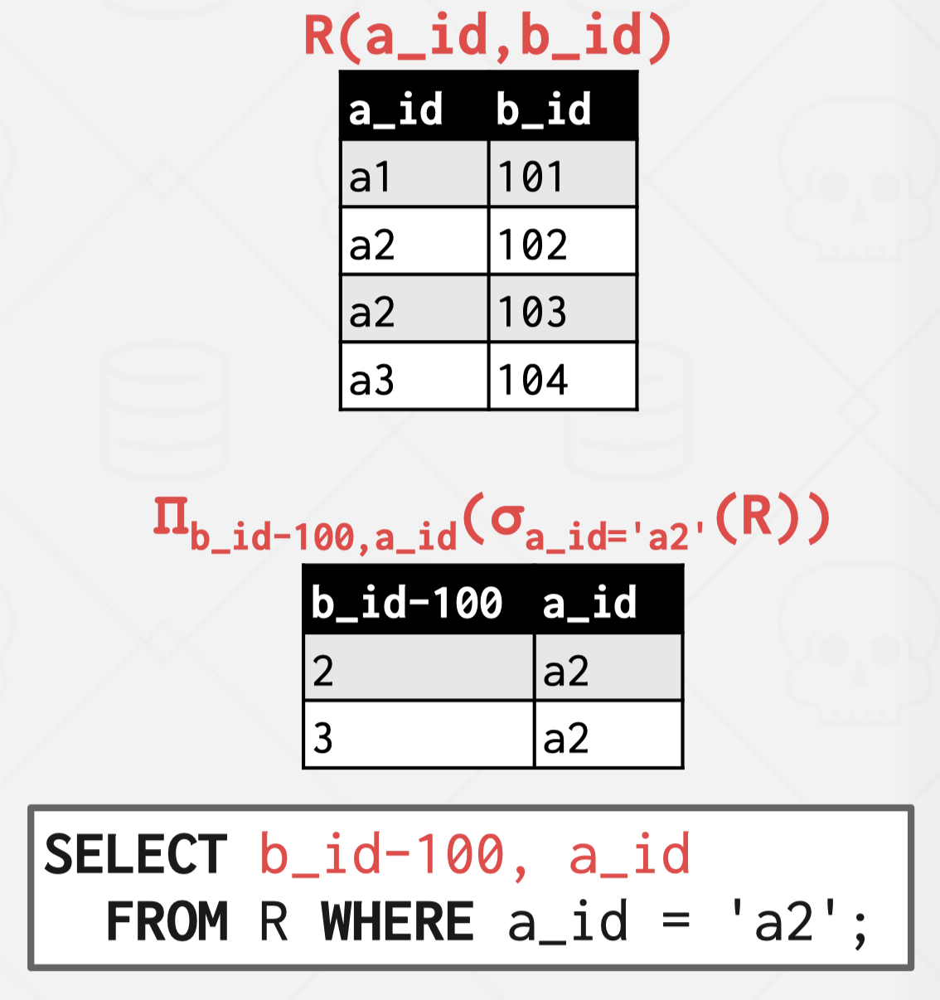
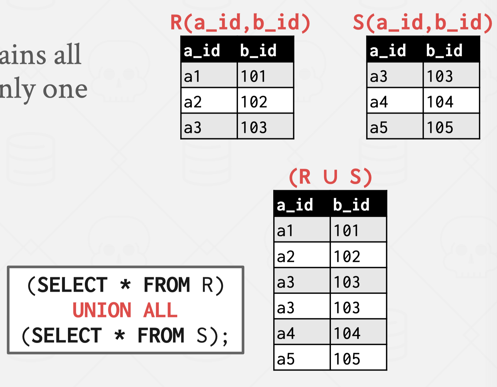
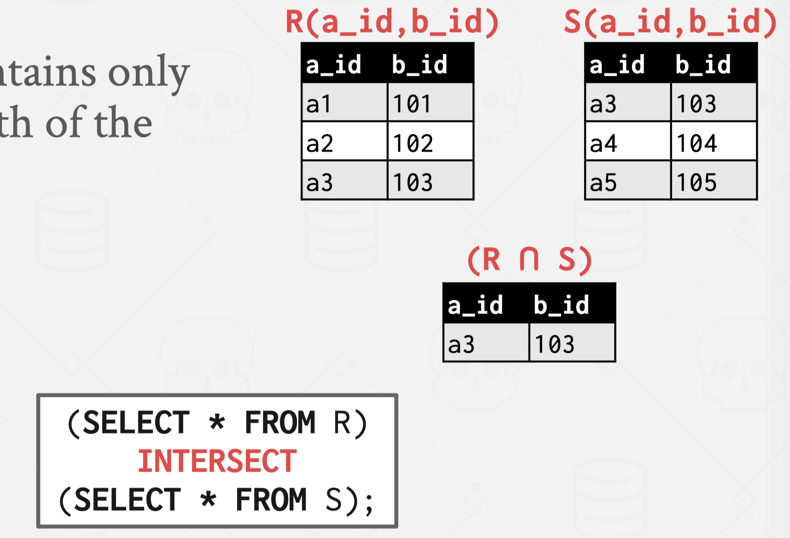
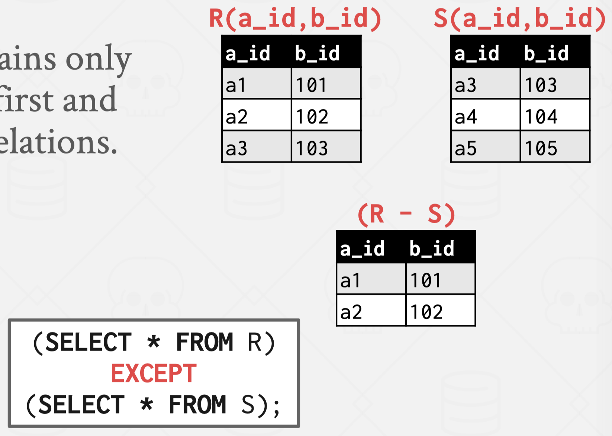
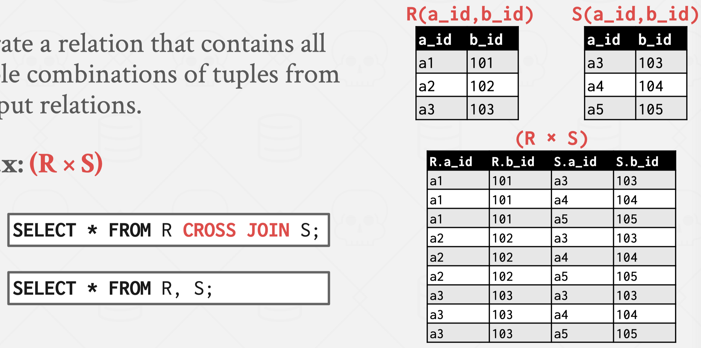
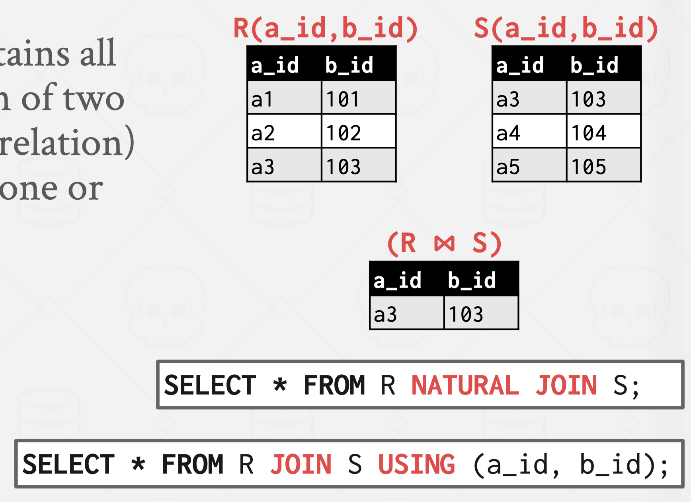
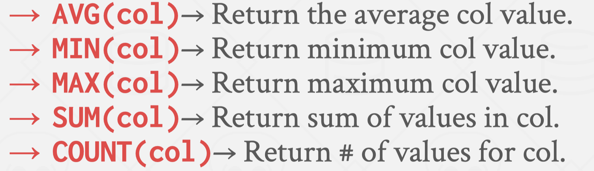

# MySQL

## 关系代数

### 选择操作: $\sigma$

### 投影操作: $\Pi$

### 并集

### 交集

### 差集

### 笛卡尔积: $\times$

### join


## 函数


## 索引
### 索引分类:
- 按数据结构分类: B+树索引、Hash索引、Full-text索引
- 按物理存储分类: 聚簇索引(主键索引，叶子结点存放实际数据)、二级索引(辅助索引，叶子结点存放主键值)
- 按字段特性分类: 主键索引(要求字段为主键)、唯一索引(要求字段为UNIQUE)、普通索引、前缀索引(针对字符类型，使用字符类型前几个字符创建索引，减少索引字段大小)
- 按字段个数分类: 单列索引、联合索引

### 回表查询、覆盖查询

### 索引缺点
- 需要占用物理内存，随数据量增大而增大
- 创建维护索引需要耗费时间，随数据量增大而增大
- 会降低表增删改查的效率，每次增删改查数据，为了维护B+树的有序性需要进行动态维护。

### 适用索引情况
- 字段有唯一性
- 经常用于WHERE查询条件字段，因为索引可以提高表查询速度，如果查询条件不是一个字段可以建立联合索引
- 经常用于GROUP BY 和 ORDER BY的字段，这样查询的时候不需要在进行排序。

### 不适用索引的情况
- WHERE、GROUP BY 和 ORDER BY用不到的字段。不需要定位，索引没什么用，还占用物理空间。
- 字段中存在大量重复数据，搜索会得到大量重复值，MySQL的查询优化器发现某个值在表的数据行中百分比很高会忽略索引，进行全表扫描。
- 表数据太少。
- 经常需要更新的字段。字段频繁修改回到子索引频繁维护，影响数据库性能。

### 索引优化
- 前缀索引优化</br>
使用前缀索引是为了减小索引字段大小，可以增加一个索引页中存储的索引值，有效提高索引的查询速度。不过，前缀索引有一定的局限性，例如：order by 就无法使用前缀索引；无法把前缀索引用作覆盖索引；

- 覆盖索引优化</br>
建立联合索引避免回表查询，使用覆盖索引的好处就是，不需要查询出包含整行记录的所有信息，也就减少了大量的 I/O 操作。


- 主键索引最好时自增的</br>
如果我们使用自增主键，那么每次插入的新数据就会按顺序添加到当前索引节点的位置，不需要移动已有的数据，当页面写满，就会自动开辟一个新页面。因为每次插入一条新记录，都是追加操作，不需要重新移动数据，因此这种插入数据的方法效率非常高。</br>
如果我们使用非自增主键，由于每次插入主键的索引值都是随机的，因此每次插入新的数据时，就可能会插入到现有数据页中间的某个位置，这将不得不移动其它数据来满足新数据的插入，甚至需要从一个页面复制数据到另外一个页面，我们通常将这种情况称为页分裂。页分裂还有可能会造成大量的内存碎片，导致索引结构不紧凑，从而影响查询效率。

- 索引最好设置为 NOT NULL

- 防止索引失效</br>
1. 对索引使用左或者左右模糊匹配时会导致索引失效.
2. 当我们在查询条件中对索引列做了计算、函数、类型转换操作。因为索引保存的是索引字段的原始值，而不是经过函数计算后的值，自然就没办法走索引了。从 MySQL 8.0 开始，索引特性增加了函数索引，即可以针对函数计算后的值建立一个索引，也就是说该索引的值是函数计算后的值，所以就可以通过扫描索引来查询数据。
```
alter table t_user add key idx_name_length ((length(name)));
```
3. 联合索引要能正确使用需要遵循最左匹配原则，也就是按照最左优先的方式进行索引的匹配，否则就会导致索引失效。在联合索引的情况下，数据是按照索引第一列排序，第一列数据相同时才会按照第二列排序。
4. 在 WHERE 子句中，如果在 OR 前的条件列是索引列，而在 OR 后的条件列不是索引列，那么索引会失效。

### B+树 VS B树 VS 二叉树/红黑树 VS Hash
- 二分查找树</br>
二叉查找树由于存在退化成链表的可能性，会使得查询操作的时间复杂度从 O(logn) 升为 O(n)。
而且会随着插入的元素越多，树的高度也变高，意味着需要磁盘 IO 操作的次数就越多，这样导致查询性能严重下降，再加上不能范围查询，所以不适合作为数据库的索引结构。

- 自平衡二叉树</br>
不管平衡二叉查找树还是红黑树，都会随着插入的元素增多，而导致树的高度变高，这就意味着磁盘 I/O 操作次数多，会影响整体数据查询的效率。

- B树</br>
B树的每个节点都包含数据（索引+记录），而用户的记录数据的大小很有可能远远超过了索引数据，这就需要花费更多的磁盘 I/O 操作次数来读到「有用的索引数据」。

- B+树</br>
1. 单点查询
B+ 树的非叶子节点不存放实际的记录数据，仅存放索引，因此数据量相同的情况下，相比存储即存索引又存记录的 B 树，B+树的非叶子节点可以存放更多的索引，因此 B+ 树可以比 B 树更「矮胖」，查询底层节点的磁盘 I/O次数会更少。
2. 插入和删除效率</br>
B+ 树有大量的冗余节点，这样使得删除一个节点的时候，可以直接从叶子节点中删除，甚至可以不动非叶子节点，这样删除非常快.

3. 范围查询</br>
B+ 树所有叶子节点间还有一个链表进行连接，对跨叶子结点的范围查询有很好的查询效率

## Count
- count(\*) 和 count(1)，count(\*) 其实等于 count(0)，也就是说，当你使用 count(\*) 时，MySQL 会将 * 参数转化为参数 0 来处理。性能一致。
- count(1)，1不是字段名，不会读取记录中的任何字段的值。
- count(主键字段名)，因为相同数量的二级索引记录可以比聚簇索引记录占用更少的存储空间，所以二级索引树比聚簇索引树小，这样遍历二级索引的 I/O 成本比遍历聚簇索引的 I/O 成本小，因此「优化器」优先选择的是二级索引。
- count(字段) 的执行效率相比前面的 count(1)、 count(*)、 count(主键字段) 执行效率是最差的。需要全表扫描。


## 事务
### 事务四大特性
- 原子性（Atomicity）：一个事务中的所有操作，要么全部完成，要么全部不完成，不会结束在中间某个环节，而且事务在执行过程中发生错误，会被回滚到事务开始前的状态，就像这个事务从来没有执行过一样。
- 一致性（Consistency）：是指事务操作前和操作后，数据满足完整性约束，数据库保持一致性状态。比如，用户 A 和用户 B 在银行分别有 800 元和 600 元，总共 1400 元，用户 A 给用户 B 转账 200 元，分为两个步骤，从 A 的账户扣除 200 元和对 B 的账户增加 200 元。一致性就是要求上述步骤操作后，最后的结果是用户 A 还有 600 元，用户 B 有 800 元，总共 1400 元，而不会出现用户 A 扣除了 200 元，但用户 B 未增加的情况（该情况，用户 A 和 B 均为 600 元，总共 1200 元）。
- 隔离性（Isolation）：数据库允许多个并发事务同时对其数据进行读写和修改的能力，隔离性可以防止多个事务并发执行时由于交叉执行而导致数据的不一致，因为多个事务同时使用相同的数据时，不会相互干扰，每个事务都有一个完整的数据空间，对其他并发事务是隔离的。
- 持久性（Durability）：事务处理结束后，对数据的修改就是永久的，即便系统故障也不会丢失。
- 持久性是通过 redo log （重做日志）来保证的；
- 原子性是通过 undo log（回滚日志） 来保证的；
- 隔离性是通过 MVCC（多版本并发控制） 或锁机制来保证的；
- 一致性则是通过持久性+原子性+隔离性来保证；

### 并行事务会引发什么问题
- 脏读: 如果一个事务「读到」了另一个「未提交事务修改过的数据」，就意味着发生了「脏读」现象。
- 不可重复读: 在一个事务内多次读取同一个数据，如果出现前后两次读到的数据不一样的情况，就意味着发生了「不可重复读」现象。
- 幻读: 在一个事务内多次查询某个符合查询条件的「记录数量」，如果出现前后两次查询到的记录数量不一样的情况，就意味着发生了「幻读」现象。