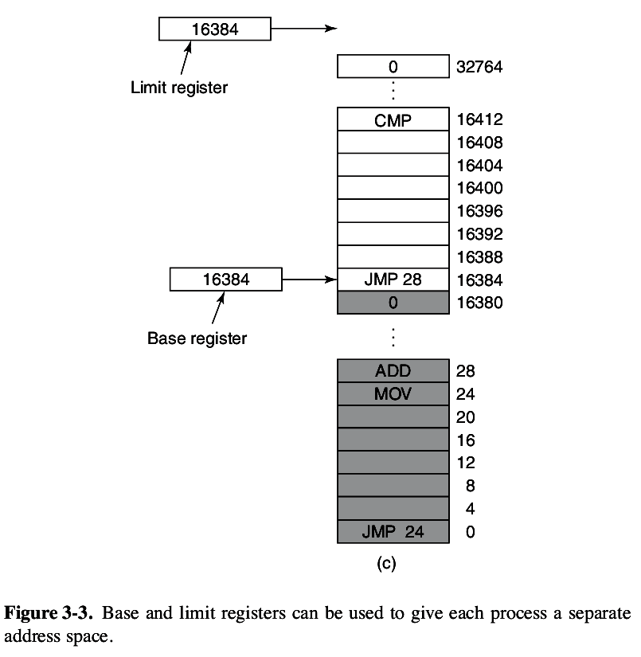
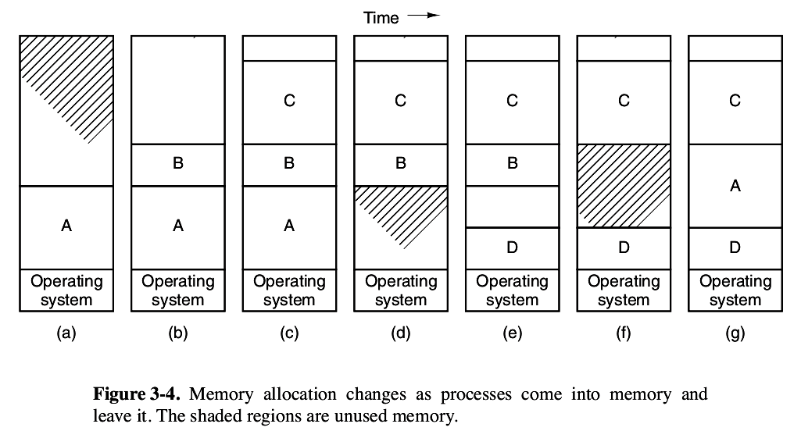
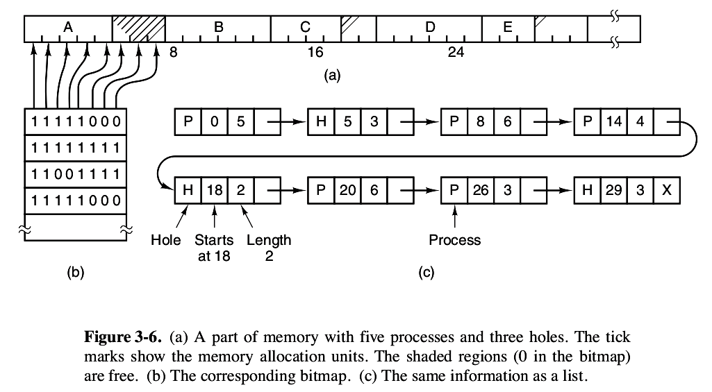
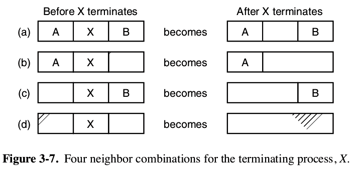

# 操作系统

## 进程与线程

## 内存管理
- 物理地址：内存中真实地址。 
  虚拟地址：经过CPU中内存管理单元进行地址翻译，转换到物理地址。
- 地址空间：一个进程可用于寻址内存的一套地址集合。
- 内存动态重定位方法：
1. 基地址寄存器和界限寄存器： 
    每个cpu配置两个特殊寄存器，基地址寄存器和界限寄存器。当一个程序运行时，程序的起始物理地址装载到基地址寄存器，程序的长度装载到界限寄存器。
    

2. 交换技术： 
    把一个进程完整调入内存，进程运行一段时间后，再把它存回磁盘。
    
    开始内存中只有A进程，之后创建B，C进程或从磁盘调入B，C进程，(d)显示A进程被交换到磁盘，然后#D被调入，B被调出，最后A被调入。
3. 虚拟内存： 
    程序只有一部分被调入内存也能够运行。

## 空闲内存管理
1. 位图存储管理
    内存被分为若干个分配单元，每个分配单元对应位图的一位，0表示空闲，1表示占用。
    缺点：当准备将一个占k个分配单元的进程调入内存时，在位图中找到k个连续0很耗时。
    
2. 空闲区链表表示法
    结点：空闲区：H，进程：P的指示标志&emsp; 起始地址&emsp; 长度&emsp;  指向下一个结点的指针
    
    - 进程内存分配算法 
    首次适配算法：存储管理器沿着链表进行搜索，直至找到一个足够大的空闲区，速度很快。 
    下次适配算法：方法同首次适配，但找到合适的空闲区后会记录当前位置，下次搜索从记录位置开始，性能略低于首次适配。 
    最佳适配算法：搜索整个链表，找到能容纳进程的最小空闲区。算法慢，会浪费更多内存，因为会产生大量无用的小空闲区。 
    最差适配算法：分配最大的空闲区。 
    快速适配算法：为常用大小的空闲区维护单独链表。